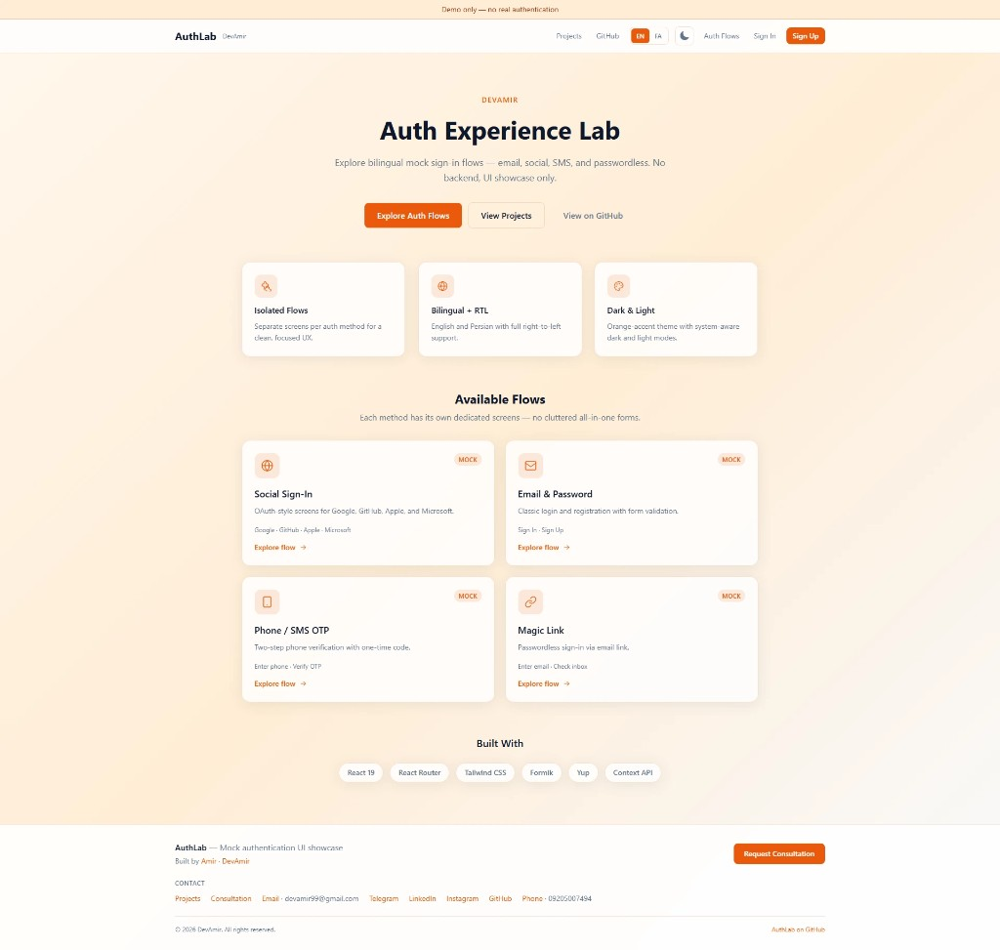
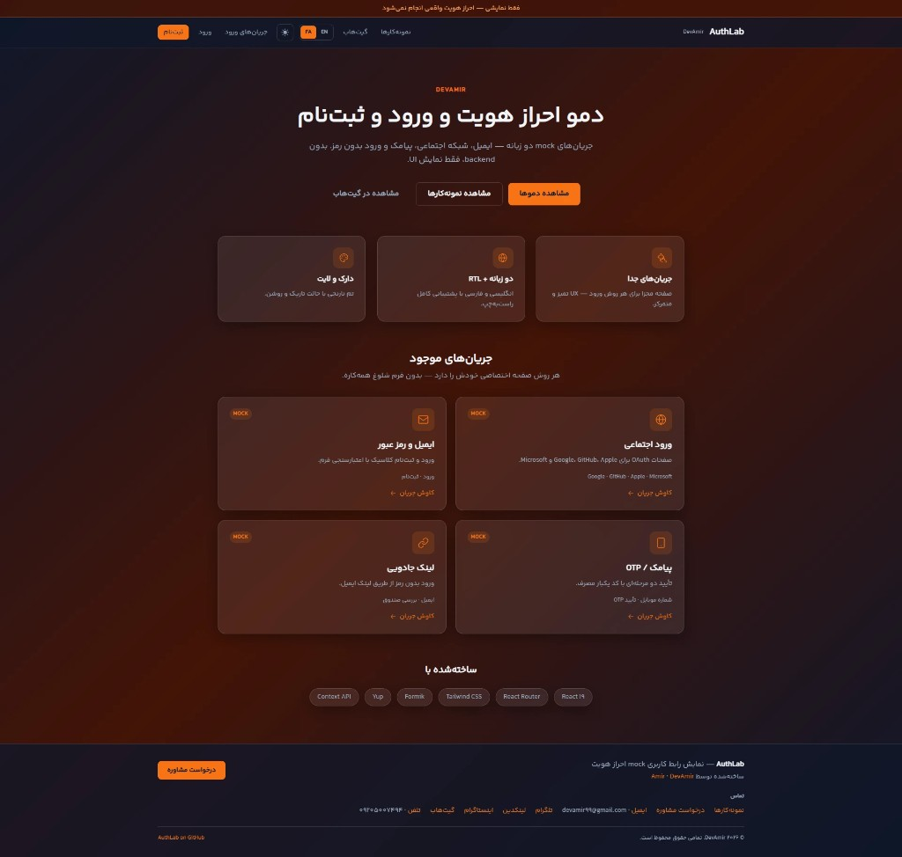
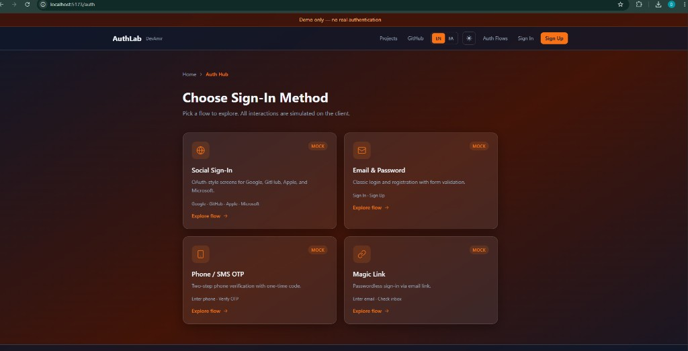
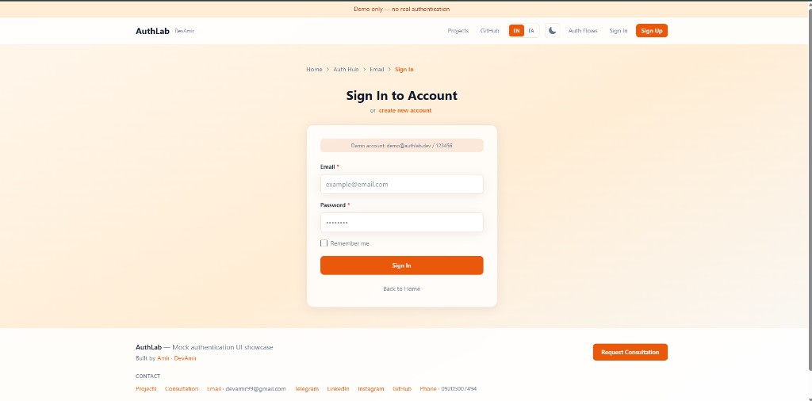
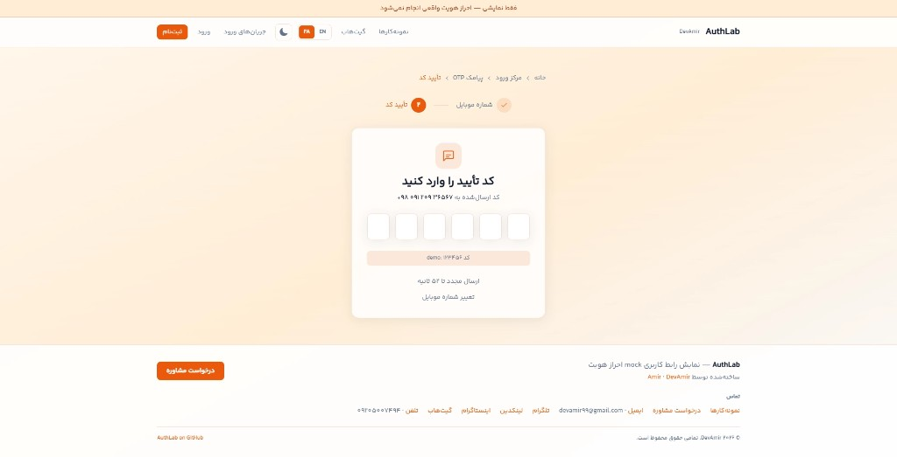
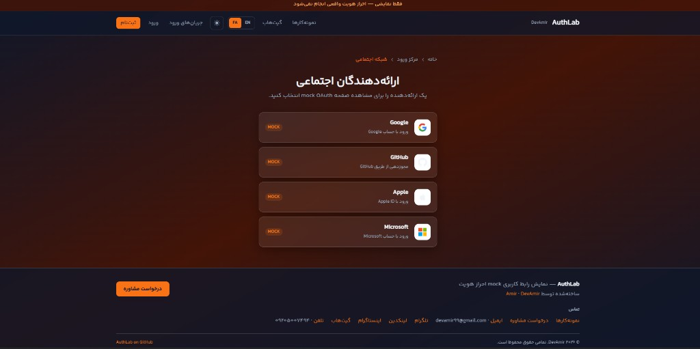

# AuthLab React

[](https://devamir.com/en/projects)
[](https://github.com/devamir99)
[](https://github.com/devamir99/authlab-react/actions)

**Auth, Login & Sign Up Demo** — a bilingual (EN/FA) mock authentication UI showcase built with React.  
Explore email, social OAuth, SMS OTP, and passwordless flows — **no backend, demonstration only**.

> Built by [Amir Fallahi (DevAmir)](https://devamir.com) as a portfolio piece.

## Screenshots

### Home — Light (EN) & Dark (FA)

| Light mode (English) | Dark mode (Persian / RTL) |
|---|---|
|  |  |

### Auth Hub & Email Login

| Auth Hub (dark) | Email sign-in |
|---|---|
|  |  |

### Phone OTP & Social OAuth

| SMS OTP verification (FA) | Social providers (FA) |
|---|---|
|  |  |

## Live Demo

**GitHub Pages:** [devamir99.github.io/authlab-react](https://devamir99.github.io/authlab-react/)

**Local:** `npm run dev` → [http://localhost:5173](http://localhost:5173)

## Case Study (Portfolio Summary)

### Problem
Authentication UIs often cram every sign-in method onto one page — OAuth buttons, email forms, phone OTP — creating a cluttered experience that's hard to demo and harder to maintain.

### Approach
**AuthLab** treats each method as an isolated flow:
- **Auth Hub** → pick a method
- Dedicated screens per provider / channel
- Client-side mock only — safe for public GitHub, no credentials in repo

### Highlights
| Area | Implementation |
|------|----------------|
| **i18n** | English + Persian with RTL |
| **Typography** | Yekan Bakh FaNum for Persian (`public/fonts/`) |
| **Theme** | Dark / light with orange accent |
| **Email** | Formik + Yup, mock session |
| **Social** | Branded OAuth consent cards (Google, GitHub, Apple, Microsoft) |
| **Phone** | 2-step OTP wizard + resend countdown |
| **Magic Link** | Email → inbox → simulate click |
| **UX** | Toast, stepper, breadcrumbs, SVG icons, 404 |

### Outcome
A **defensible portfolio demo** — shows UI/UX thinking and React architecture without shipping a copy-paste production auth backend.

**Featured on:** [devamir.com/en/projects](https://devamir.com/en/projects)

---

## Author — Amir (DevAmir)

| | |
|---|---|
| **Projects** | [devamir.com/en/projects](https://devamir.com/en/projects) |
| **Consultation** | [devamir.com/en/contact](https://devamir.com/en/contact) |
| **Email** | [devamir99@gmail.com](mailto:devamir99@gmail.com) |
| **GitHub** | [github.com/devamir99](https://github.com/devamir99) |
| **LinkedIn** | [linkedin.com/in/devamir](https://www.linkedin.com/in/devamir/) |
| **Instagram** | [instagram.com/devamirr](https://www.instagram.com/devamirr) |
| **Telegram** | [t.me/devamir99](https://t.me/devamir99) |
| **Phone** | [09205007494](tel:+989205007494) |

---

## Quick Start

```bash
git clone https://github.com/devamir99/authlab-react.git
cd authlab-react
npm install
npm run dev
```

## Demo Flows

| Flow | Route | Demo hint |
|------|--------|-----------|
| Email | `/auth/email/login` | `demo@authlab.dev` / `123456` |
| Social | `/auth/social` → provider | Click Authorize |
| Phone | `/auth/phone` | OTP `123456` |
| Magic Link | `/auth/magic-link` | Simulate click |

## Deploy

```bash
npm run build
```

- **GitHub Pages:** push to `main` — workflow `Deploy to GitHub Pages` builds and publishes `dist/`
- **Vercel:** `vercel.json` included (SPA rewrites)
- **CI:** GitHub Actions runs lint + build on push

## Scripts

```bash
npm run dev      # Development
npm run build    # Production build
npm run preview  # Preview build
npm run lint     # ESLint
```

## Tech Stack

React 19 · Vite · React Router · Tailwind CSS 4 · Formik · Yup · Context API

## License

MIT — see [LICENSE](LICENSE).

---

**Note:** UI showcase only — not for production without a real backend.
